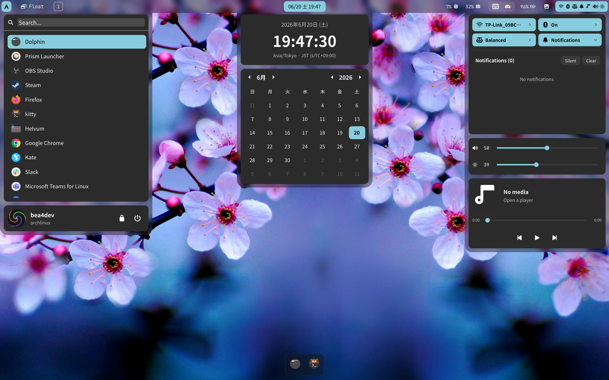

<div align="center">
<h2>Shoji Bar 2</h2>

The default desktop shell for [ShojiWM](https://bea4dev.github.io/ShojiWM/).



</div>

Shoji Bar 2 is an [AGS](https://aylur.github.io/ags/) (Astal + GTK4) desktop
shell written in TypeScript/JSX. It is built for **ShojiWM** and integrates with
it over a Unix-socket IPC, but most widgets work on any wlroots-style Wayland
compositor that supports the layer-shell protocol.

## Features

- **Top bar** — start menu, workspaces, tiling/floating layout indicator,
  clock + calendar, system tray, CPU / memory indicators, battery, wallpaper
  picker, and a status area (Wi-Fi, Bluetooth, audio, brightness, power
  profiles, notifications, media controls).
- **Dock** — auto-hiding, pinned + running apps, per-app window list.
- **Start menu** — searchable application launcher with user info / power menu.
- **Clipboard history** — text and image entries with thumbnails (`Super+V`).
- **Wallpaper picker** — thumbnail grid + a monitor-identify overlay.
- **Snap-zone preview** — Windows-style edge-snapping overlay driven by ShojiWM.
- **Notifications** — popups + a notification center in the status menu.

## Dependencies

> **In practice, installing AGS pulls in almost everything below.** The AGS
> package depends on GTK 4, `gtk4-layer-shell`, and the Astal libraries, so once
> `ags` is installed the GTK/Astal side generally just works. You typically only
> need to install the **command-line tools** and the **backing system services**
> separately.

### Core

- [AGS](https://aylur.github.io/ags/) ≥ 3 (the `ags` CLI; provides the `gnim`
  runtime and the GTK4 bindings). Installing this normally brings in GTK 4,
  `gtk4-layer-shell`, and the Astal libraries as dependencies.
- GTK 4
- `gtk4-layer-shell`

### Astal libraries

These back individual widgets (imported as `gi://Astal*`) and usually arrive
together with AGS — you rarely need to install them by hand. All are used by the
default layout:

| Library            | Used for                          | Backing service          |
| ------------------ | --------------------------------- | ------------------------ |
| `AstalApps`        | application launcher / dock        | `.desktop` files         |
| `AstalBattery`     | battery indicator                 | UPower                   |
| `AstalNetwork`     | Wi-Fi status                      | NetworkManager           |
| `AstalNotifd`      | notifications                     | (built-in daemon)        |
| `AstalMpris`       | media controls                    | any MPRIS player         |
| `AstalWp`          | volume control                    | WirePlumber / PipeWire   |
| `AstalPowerProfiles` | power-profile toggle            | power-profiles-daemon    |
| `AstalTray`        | system tray                       | StatusNotifierItem hosts |

### Command-line tools

| Tool                              | Used for                         |
| --------------------------------- | -------------------------------- |
| `nmcli` (NetworkManager)          | Wi-Fi scan / connect / toggle    |
| `bluetoothctl` (BlueZ)            | Bluetooth devices                |
| `rfkill` (util-linux)             | Bluetooth radio toggle           |
| `brightnessctl`                   | screen brightness                |
| `cliphist`                        | clipboard history store / decode |
| `wl-clipboard` (`wl-copy` / `wl-paste`) | clipboard read / write     |
| `imagemagick` (`magick`)          | clipboard image thumbnails       |
| `bash`                            | pipelines for the above          |

> The clipboard chain is: `cliphist list` to enumerate, `cliphist decode <id> |
> wl-copy` to restore, and `cliphist decode <id> | magick - -thumbnail 480x300`
> to build image thumbnails (cached under `$TMPDIR/shoji-bar-2-clip`).

## Installation

The shell is loaded directly from `~/.config/shoji-bar-2`.

```sh
# 1. Clone into the config directory
git clone https://github.com/bea4dev/shoji-bar-2 ~/.config/shoji-bar-2
cd ~/.config/shoji-bar-2

# 2. Generate the GObject-introspection type stubs (@girs).
#    Run this after the Astal libraries above are installed; it introspects the
#    typelibs present on the system. Re-run it whenever you add/upgrade a library.
ags types -u -d ./

# 3. (optional) JS tooling for editing / formatting (gnim types, prettier)
npm install
```

Then run it:

```sh
# Standalone
ags run app.tsx

# Or let ShojiWM autostart it (already wired in the ShojiWM config):
#   GTK_A11Y=none ags run app.tsx
```

> `GTK_A11Y=none` disables the AT-SPI accessibility bridge. A status bar never
> needs a screen reader, and it avoids a GTK 4.22 accessibility notify-storm
> that can peg a CPU core when a tray menu is torn down while open.

### Clipboard history setup

`cliphist` only contains entries while clipboard watchers are running. Start
one watcher per MIME class (text + image):

```sh
wl-paste --type text  --watch cliphist store &
wl-paste --type image --watch cliphist store &
```

The ShojiWM config starts these automatically as restartable services, so under
ShojiWM no extra setup is required.

### User-provided assets

| Path                     | Purpose                                            |
| ------------------------ | -------------------------------------------------- |
| `~/Pictures/icon.png`    | avatar shown in the start menu user card           |
| `~/Pictures/wallpapers/` | source folder scanned by the wallpaper picker      |

Runtime state is written next to the config and is git-ignored:
`wallpapers.json` (per-monitor wallpaper) and `dock.json` (pinned apps).

## ShojiWM integration

The bar talks to ShojiWM over the Unix socket
`$XDG_RUNTIME_DIR/shojiwm-$WAYLAND_DISPLAY.sock` (newline-delimited JSON). It
consumes broadcasts (workspace layout, dock proximity, snap-zone previews) and
sends commands (switch/activate workspace, activate window).

It also exposes a few `ags request` commands that ShojiWM binds to keys:

```sh
ags request -i ags start-menu toggle <connector>   # Super+A
ags request -i ags clipboard  toggle <connector>   # Super+V
```

## Development

```sh
npx tsc --noEmit -p tsconfig.json   # type-check
ags bundle app.tsx /tmp/out.js      # bundle check (compiles TS + SCSS)
npm run format                      # prettier
```

A diagnostic script for when the shell pegs a CPU core lives at
[`scripts/diag-bar-perf.sh`](./scripts/diag-bar-perf.sh) (perf + stack/log
capture; see the header for usage).
